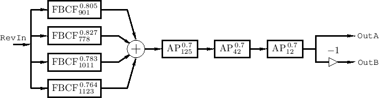

# OpenMP-ReverbDSP
Schroeder Reverberator implementation with paralelization of audio processing using OpenMP.\
\
I implemented two versions of this, one sequential (secuencial) to test that it works, and the other in parallel (paralelo) with OpenMP.

## For this project you need
* OpenMP (with a CPU that has multiple cores)\
* PortAudio Library -> http://www.portaudio.com/
* Libsndfile -> http://www.mega-nerd.com/libsndfile/ \
or -> https://github.com/libsndfile/libsndfile
## Detail
It implements a circular buffer structure that stores the T seconds delayed sample, to use it in the current sample, this prevents that the reverb never occurs at lower buffer sizes and it allows for longer reverbs.\
\
The architecture of the reverberator consists of:
* Four Parallel Feedback Comb Filters.
* Three Sequential All Pass Filters.
* Dry and Wet Mix.\
\
given by the following Schroeder reverberator example diagram.

\
\
with the boxes upper numbers being the decay factor (that reduces the amplitude), and the lower numbers are the delay in milliseconds (these parameters can be modified in the code).\
It also creates a .wav file to listen to the output of the processing, also, you can playback the audio via your headphones or audio interface into speakers, it depends of your audio inputs and outputs, which you can modify via code in main function where it lists all your enabled audio devices.
